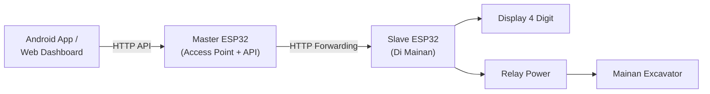

# Proposal Pengembangan Module Timer Rental Mainan Excavator

## 1. Ringkasan Proposal

Proposal ini menawarkan pengembangan module timer untuk mainan excavator remote control yang akan digunakan pada bisnis rental mainan di mall atau tempat bermain.

Module dipasang ke mainan excavator RC tanpa mengganti remote bawaan. Customer tetap menggunakan remote RC seperti biasa. Staff/operator mengatur waktu sewa melalui aplikasi Android atau Web Dashboard.

Sistem dibuat dengan konsep murah, menggunakan arsitektur Wi-Fi Master-Slave, sehingga stabil dan mudah dioperasikan.

## 2. Tujuan Produk

Tujuan utama produk:

- Mainan bisa disewakan berdasarkan durasi waktu.
- Staff bisa menambah waktu sewa dari HP/tablet Android secara terpusat.
- Mainan otomatis mati saat waktu habis.
- Sisa waktu terlihat langsung di mainan melalui display 4 digit.
- Timer tidak hilang saat battery 18650 diganti (Powerloss Recovery).
- Banyak mainan bisa dipantau dari satu dashboard pusat (Master).
- Biaya module tetap rendah agar cocok untuk pedagang.

## 3. Masalah Yang Diselesaikan

Pada rental mainan manual, operator sering mengalami masalah:

- Waktu sewa harus dipantau manual.
- Staff harus mengingat kapan mainan harus dimatikan.
- Banyak mainan sulit dipantau bersamaan.
- Customer tidak tahu sisa waktu bermain.
- Battery habis bisa mengganggu sesi customer.
- Dibutuhkan sistem yang saling terintegrasi tanpa perlu router mahal atau internet cloud.

Module ini menyelesaikan masalah tersebut dengan timer lokal di mainan, disinkronisasi ke satu Master lokal, dan dipantau dari Dashboard.

## 4. Solusi Yang Ditawarkan

Sistem menggunakan 1 Master (ESP32 sebagai Access Point pusat) dan banyak Slave (ESP32 di setiap mainan).

Fungsi module Slave di mainan:
- Mengatur ON/OFF power mainan memakai relay.
- Menyimpan sisa waktu ke memori NVS (aman dari powerloss).
- Menampilkan sisa waktu di display 4 digit.
- Melaporkan status secara rutin via Wi-Fi ke Master.

Fungsi Master:
- Memancarkan Wi-Fi Access Point mandiri (tanpa butuh internet).
- Mengatur ID dan IP masing-masing mainan secara otomatis (*Zero-Touch Provisioning*).
- Menjadi Web Server untuk Dashboard.
- Meneruskan perintah dari Android ke mainan yang tepat (*API Proxy Gateway*).

Arsitektur sistem:



## 5. Cara Kerja Untuk Operator

### Mulai Sewa

1. Staff membuka aplikasi Android atau Web Dashboard.
2. Dashboard menampilkan daftar mainan (EXC-01, EXC-02, dst) secara real-time.
3. Staff memilih mainan.
4. Staff menekan tombol `+5 menit`.
5. Master meneruskan perintah ke Slave mainan tersebut.
6. Slave menyalakan mainan, dan Display menampilkan countdown.
7. Customer bermain memakai remote RC bawaan.

### Tambah Waktu

1. Saat waktu hampir habis, staff bisa menekan `+5 menit` atau `+10 menit` dari dashboard.
2. Waktu pada Slave bertambah.
3. Mainan tetap berjalan tanpa harus restart.

### Waktu Habis

1. Timer di Slave mencapai 0.
2. Slave mematikan relay.
3. Power mainan terputus, Display kedip menampilkan 0000.
4. Master otomatis tahu status mainan tersebut selesai.

### Ganti Battery (Hot-Swap)

1. Jika battery habis, staff langsung mengganti 18650.
2. Saat battery dicabut, Slave mati.
3. Setelah battery baru dipasang, Slave menyala dan memulihkan sisa waktu dari NVS.
4. Status otomatis menjadi `PAUSED` (demi keamanan, agar tidak tiba-tiba jalan).
5. Staff menekan `Resume` di aplikasi.
6. Customer bisa melanjutkan sisa waktu.

## 6. Fitur MVP

Fitur yang masuk versi awal:

- Arsitektur Wi-Fi Master-Slave mandiri (tanpa butuh router eksternal).
- Zero-Touch Provisioning (Slave otomatis terdaftar ke Master).
- NVS Powerloss Recovery (Timer aman meski baterai dicabut).
- Dashboard Android & Web UI untuk melihat banyak mainan.
- Tambah waktu per 5 menit, 10 menit, Pause, Resume, Stop.
- Display 4 digit di mainan untuk countdown.
- Relay murah untuk ON/OFF mainan.
- Pengaturan Registry (Ubah ID, Hapus Slave) langsung dari WebUI.

## 7. Contoh Tampilan Dashboard

```text
EXC-01  RUNNING   03:20  OK
EXC-02  LOCKED    --     OK
EXC-03  PAUSED    02:40  LOW
EXC-04  OFFLINE   --     --
```

## 8. Komponen Hardware Per Mainan (Slave)

| Komponen | Fungsi |
| --- | --- |
| ESP32 | Otak module, koneksi Wi-Fi, timer |
| Relay 3.3V/5V | Memutus/menyambung power mainan |
| Display TM1637 4 digit | Menampilkan sisa waktu |
| Regulator 3.3V (Buck) | Menstabilkan power untuk ESP32 |
| Casing kecil | Pelindung module |

*Master hanya butuh 1 buah ESP32 tanpa modul tambahan lain, diletakkan di meja kasir.*

## 9. Keunggulan Solusi

- **Sangat Mandiri:** Memiliki jaringan Wi-Fi sendiri dari Master ESP32, tidak butuh internet atau router mall.
- **Auto-Sync:** Perangkat mainan baru tinggal dinyalakan, langsung otomatis terhubung ke jaringan dan siap pakai.
- **Anti Hilang Waktu:** Baterai dicabut paksa pun waktu sewa akan otomatis kembali.
- **Terpusat:** Developer Android/Frontend cukup tembak API ke 1 IP Master.

## 10. Batasan MVP

- Tidak mengontrol gerakan excavator dari HP (hanya power ON/OFF).
- Tidak terkoneksi ke Cloud/Server global (hanya jaringan lokal).
- Android harus terhubung ke jaringan Wi-Fi yang dipancarkan oleh Master ESP32.

## 11. Opsi Upgrade Setelah MVP

- Koneksi Master ke Cloud Server via Wi-Fi Mall untuk laporan pendapatan ke Bos/Owner jarak jauh.
- Sistem paket harga jam-jaman.
- Scanner QR atau RFID untuk mainan.
- Notifikasi Telegram bot via Master jika ada masalah.

## 12. Deliverable Project

- Spesifikasi produk MVP.
- Wiring diagram module.
- Firmware Master ESP32 (AP, WebServer, Proxy).
- Firmware Slave ESP32 (Client, Relay, NVS, TM1637).
- Dokumentasi API `WIFI_API_SPEC.md`.
- SDK/Template API untuk Android di `ExcavatorWifiManager.kt`.

## 13. Kriteria Sukses

Project dianggap berhasil jika:

- Master bisa mengatur minimal 10 slave secara bersamaan tanpa delay parah.
- Slave otomatis terdaftar di Master saat baru dinyalakan.
- Staff bisa menambah waktu, mainan menyala, dan otomatis mati saat habis.
- Timer tidak hilang saat baterai slave diganti (*Powerloss Recovery*).
- Command Android dapat tersalurkan dari Master ke Slave bersangkutan dengan lancar.

## 14. Penutup

Solusi ini dirancang sebagai sistem yang mandiri, pintar, dan sangat memanjakan developer frontend Android maupun staf di lapangan.
Dengan ESP32 yang dipecah perannya (satu Master sebagai otak pusat, banyak Slave sebagai eksekutor di lapangan), sistem ini menjadi *robust* namun tetap menekan biaya produksi karena tetap menggunakan komponen-komponen terjangkau.
