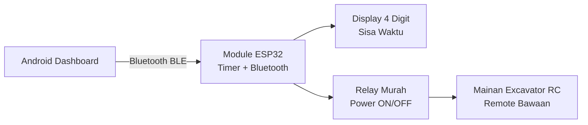

# Proposal Pengembangan Module Timer Rental Mainan Excavator

## 1. Ringkasan Proposal

Proposal ini menawarkan pengembangan module timer untuk mainan excavator remote control yang akan digunakan pada bisnis rental mainan di mall atau tempat bermain.

Module dipasang ke mainan excavator RC murah tanpa mengganti remote bawaan. Customer tetap menggunakan remote RC seperti biasa. Staff/operator mengatur waktu sewa melalui aplikasi Android.

Sistem dibuat dengan konsep murah, mudah dipasang, dan mudah dioperasikan oleh pedagang.

## 2. Tujuan Produk

Tujuan utama produk:

- Mainan bisa disewakan berdasarkan durasi waktu.
- Staff bisa menambah waktu sewa dari HP/tablet Android.
- Mainan otomatis mati saat waktu habis.
- Sisa waktu terlihat langsung di mainan melalui display 4 digit.
- Timer tidak hilang saat battery 18650 diganti.
- Banyak mainan bisa dipantau dari satu dashboard Android.
- Biaya module tetap rendah agar cocok untuk pedagang.

## 3. Masalah Yang Diselesaikan

Pada rental mainan manual, operator sering mengalami masalah:

- Waktu sewa harus dipantau manual.
- Staff harus mengingat kapan mainan harus dimatikan.
- Banyak mainan sulit dipantau bersamaan.
- Customer tidak tahu sisa waktu bermain.
- Battery habis bisa mengganggu sesi customer.
- Dibutuhkan sistem murah, bukan sistem IoT mahal.

Module ini menyelesaikan masalah tersebut dengan timer lokal di mainan dan dashboard Android untuk operator.

## 4. Solusi Yang Ditawarkan

Setiap mainan akan dipasang satu module timer berbasis ESP32.

Fungsi module:

- Mengatur ON/OFF power mainan memakai relay.
- Menyimpan sisa waktu di memori ESP32.
- Menampilkan sisa waktu di display 4 digit.
- Melaporkan status ke aplikasi Android melalui Bluetooth Low Energy.
- Menerima command dari Android, seperti tambah waktu, pause, resume, dan stop.

Arsitektur sederhana:



## 5. Cara Kerja Untuk Operator

### Mulai Sewa

1. Staff membuka aplikasi Android.
2. Dashboard menampilkan daftar mainan, misalnya `EXC-01`, `EXC-02`, `EXC-03`.
3. Staff memilih mainan.
4. Staff menekan tombol `+5 menit`.
5. Module menyalakan mainan.
6. Display pada mainan menampilkan countdown.
7. Customer bermain memakai remote RC bawaan.

### Tambah Waktu

1. Saat waktu hampir habis, staff bisa menekan `+5 menit` atau `+10 menit`.
2. Waktu pada module bertambah.
3. Display pada mainan ikut berubah.
4. Mainan tetap berjalan tanpa harus restart.

### Waktu Habis

1. Timer mencapai 0.
2. Module mematikan relay.
3. Power mainan terputus.
4. Display menampilkan waktu habis.
5. Dashboard Android melihat status selesai.

### Ganti Battery

1. Jika battery habis, staff mengganti 18650.
2. Module boleh mati saat battery dicabut.
3. Setelah battery baru dipasang, module membaca sisa waktu terakhir.
4. Status menjadi `PAUSED`.
5. Staff menekan `Resume`.
6. Customer bisa melanjutkan sisa waktu.

## 6. Fitur MVP

Fitur yang masuk versi awal:

- Dashboard Android untuk melihat banyak mainan.
- Bluetooth BLE direct dari Android ke mainan.
- Tambah waktu per 5 menit.
- Tombol `+10 menit`.
- Pause.
- Resume.
- Stop.
- Status battery sederhana: `OK`, `LOW`, `CRITICAL`.
- Display 4 digit di mainan untuk countdown.
- Relay murah untuk ON/OFF mainan.
- Penyimpanan timer di ESP32 agar tidak reset saat battery diganti.
- QR provisioning untuk daftar mainan ke aplikasi.
- Log transaksi sederhana di aplikasi.

## 7. Contoh Tampilan Dashboard

```text
EXC-01  RUNNING   03:20  OK
EXC-02  LOCKED    --     OK
EXC-03  PAUSED    02:40  LOW
EXC-04  OFFLINE   --     --
```

Tombol pada detail mainan:

```text
[+5 menit]  [+10 menit]
[Pause]     [Resume]
[Stop]      [Clear Fault]
```

## 8. Komponen Hardware Per Mainan

Estimasi komponen per unit:

| Komponen | Fungsi |
| --- | --- |
| ESP32 / ESP32-C3 | Otak module, Bluetooth, timer |
| Relay 3V/3.3V | Memutus/menyambung power mainan |
| Driver relay | Pengaman agar GPIO ESP32 tidak langsung menyalakan relay |
| Display TM1637 4 digit | Menampilkan sisa waktu |
| Holder 18650 | Tempat battery yang bisa diganti |
| Regulator 3.3V | Menstabilkan power untuk ESP32 |
| Voltage divider | Deteksi battery low |
| Fuse/PTC | Proteksi arus |
| Kapasitor | Mengurangi reset akibat hentakan motor |
| Casing kecil | Pelindung module |
| QR sticker | Identitas mainan untuk aplikasi |

## 9. Keunggulan Solusi

- Murah karena memakai relay dan ESP32.
- Tidak perlu Wi-Fi.
- Tidak perlu router.
- Tidak perlu server/cloud untuk MVP.
- HP/tablet operator tetap bisa memakai internet sendiri.
- Remote RC bawaan tetap digunakan.
- Mudah dijelaskan ke pedagang.
- Cocok untuk 10 mainan dalam satu area booth.
- Timer tetap aman walau battery diganti.

## 10. Batasan MVP

Versi awal memiliki batasan:

- Tidak mengontrol gerakan excavator dari HP.
- Tidak memakai Wi-Fi/cloud.
- Tidak cocok untuk monitoring jarak jauh.
- Android harus berada dekat area mainan agar BLE terbaca.
- Jika battery dicabut mendadak, sisa waktu bisa mundur beberapa detik sesuai interval penyimpanan.
- Setelah battery baru, mainan tidak langsung hidup otomatis demi keamanan.
- Status battery berupa kategori, bukan persen akurat.

## 11. Opsi Upgrade Setelah MVP

Fitur tambahan yang bisa dikembangkan setelah versi awal:

- PCB custom agar lebih rapi.
- FRAM memory agar timer bisa disimpan lebih sering.
- Supercapacitor agar ESP32 sempat menyimpan data saat battery dicabut.
- Gateway untuk banyak unit lebih dari 20 mainan.
- Cloud dashboard untuk banyak cabang.
- Report pendapatan harian.
- Akun staff/operator.
- Sistem paket harga otomatis.
- Printer struk atau QR payment.
- Casing custom sesuai body mainan.

## 12. Deliverable Project

Deliverable yang disiapkan:

- Spesifikasi produk MVP.
- Wiring diagram module.
- Firmware ESP32 untuk timer, BLE, display, relay, dan storage.
- Protocol BLE untuk komunikasi Android dan module.
- Flow aplikasi Android.
- Mockup dashboard Android.
- Dokumentasi teknis untuk pengembangan lanjutan.
- Proposal sistem untuk presentasi ke calon user/pedagang.

## 13. Estimasi Tahapan Pengerjaan

Tahapan pengerjaan yang disarankan:

| Tahap | Output |
| --- | --- |
| Prototype 1 unit | ESP32 + relay + display + timer berjalan |
| Test battery hotswap | Timer tidak reset setelah battery diganti |
| BLE command | Android bisa tambah waktu, pause, resume, stop |
| Dashboard 10 unit | Aplikasi bisa melihat banyak mainan |
| Pilot lapangan | Test operasional pada booth rental |
| Produksi awal | Rapikan casing, wiring, dan SOP pemasangan |

## 14. Kriteria Sukses

Project dianggap berhasil jika:

- Staff bisa melihat minimal 10 mainan di dashboard.
- Staff bisa menambah waktu mainan per 5 menit.
- Mainan otomatis mati saat waktu habis.
- Display di mainan menunjukkan sisa waktu.
- Timer tidak reset total saat battery diganti.
- Battery low membuat mainan pause dan menyimpan sisa waktu.
- Module tetap aman saat ESP32 reset.
- Customer bisa memakai remote RC bawaan tanpa perubahan cara bermain.

## 15. Asumsi

Asumsi awal:

- Mainan excavator memakai battery 18650 atau supply battery yang bisa diakses.
- Power mainan bisa diputus dari jalur positive battery.
- Ruang dalam body mainan cukup untuk module kecil.
- Staff yang mengganti battery, bukan customer.
- Android dashboard dipakai oleh owner/staff.
- Satu booth berisi sekitar 10 mainan.

## 16. Hal Yang Perlu Dikonfirmasi

Sebelum produksi, perlu dikonfirmasi:

- Model mainan excavator yang akan dipakai.
- Tegangan dan arus motor saat jalan/stall.
- Ukuran ruang dalam mainan.
- Jenis holder battery yang diinginkan.
- Lokasi display pada body mainan.
- Lokasi casing module.
- Apakah battery bisa dikunci agar tidak dicabut customer.
- Target harga jual module per unit.

## 17. Penutup

Solusi ini dirancang sebagai MVP murah dan praktis untuk pedagang rental mainan excavator. Fokus utama bukan membuat sistem rumit, melainkan membuat mainan bisa disewakan dengan timer yang jelas, mudah dikontrol, dan tetap aman saat battery diganti.

Dengan pendekatan BLE direct, relay murah, display 4 digit, dan ESP32 sebagai timer lokal, sistem bisa dibuat sederhana namun cukup kuat untuk uji coba bisnis di mall.

