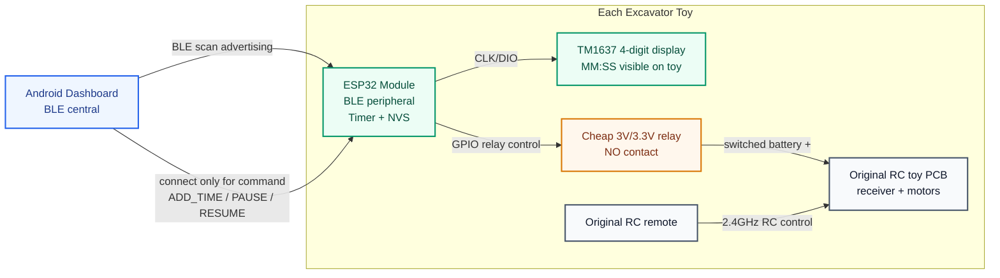
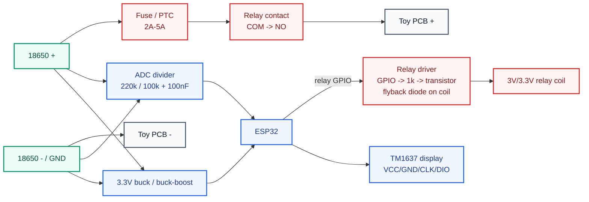
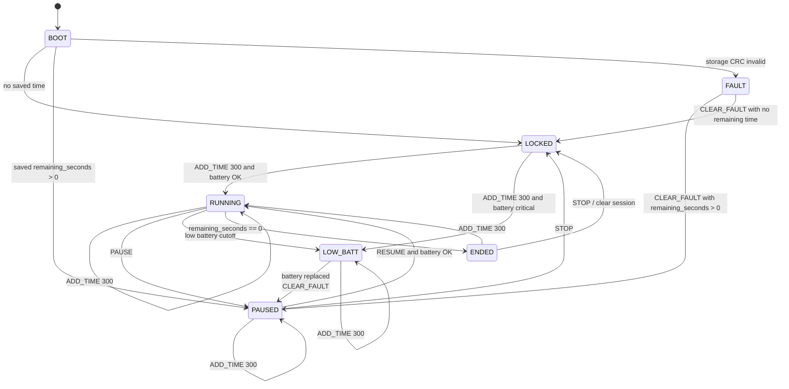
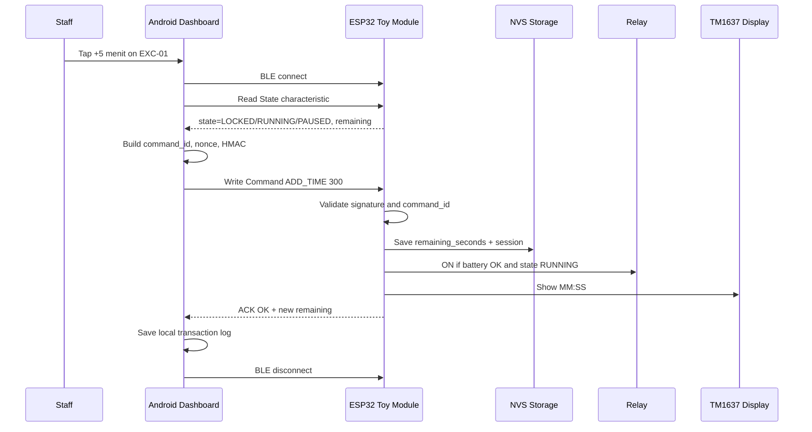
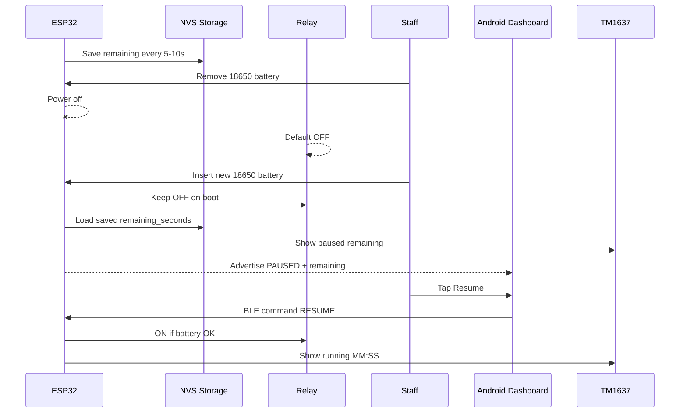
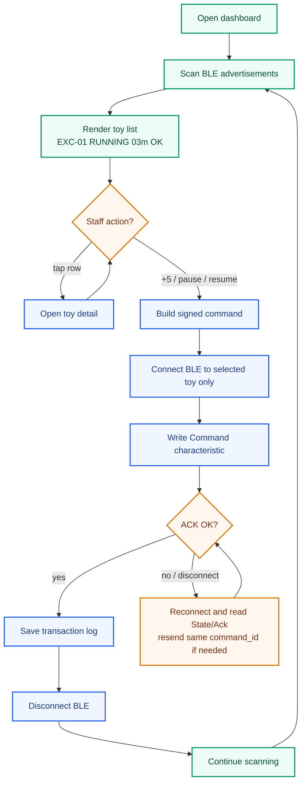
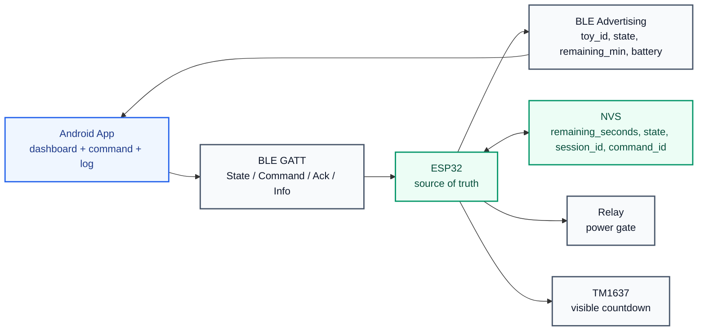

# Mermaid Diagrams - Excavator Timer MVP

Diagram ini memakai Mermaid.js supaya mudah dirender di GitHub, Markdown preview, dan dokumentasi web. Referensi yang dipakai: Mermaid flowchart, sequence diagram, state diagram, subgraph, dan `classDef` dari docs resmi Mermaid.

## 1. MVP System Architecture

## 2. Cheap Relay Wiring

## 3. Runtime State Machine

## 4. Add Time BLE Command

## 5. Battery Hotswap Flow

## 6. Android BLE Direct Dashboard Flow

## 7. BLE Data Ownership

