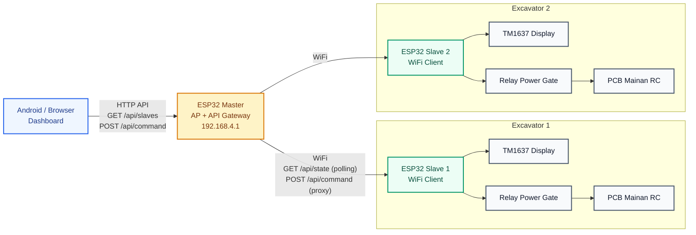
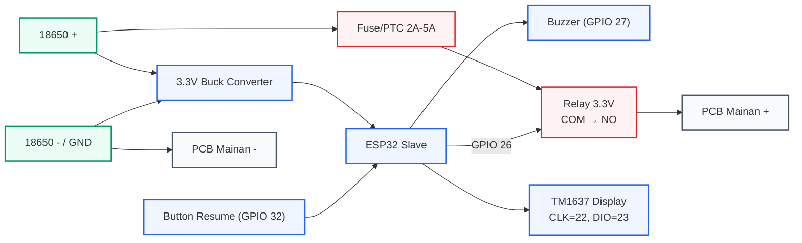
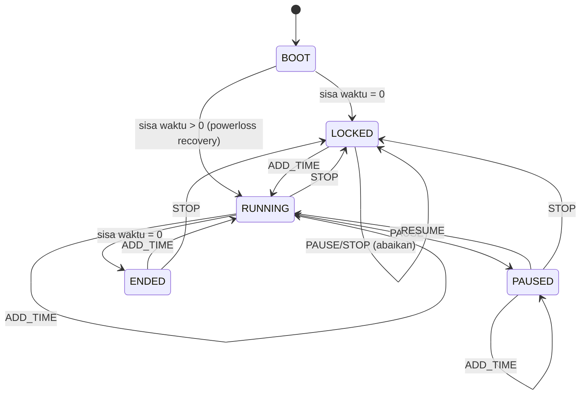
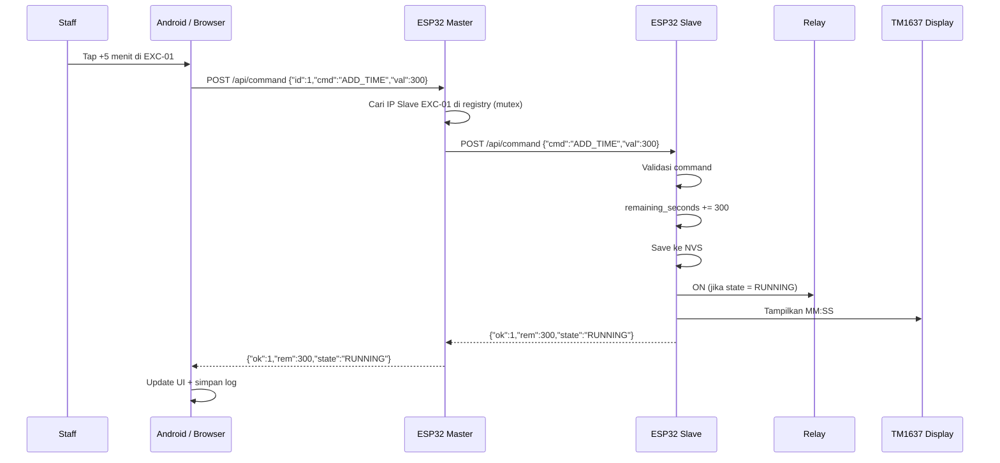
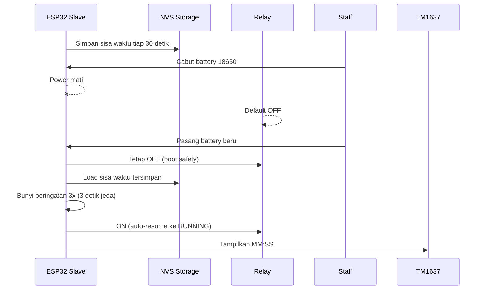
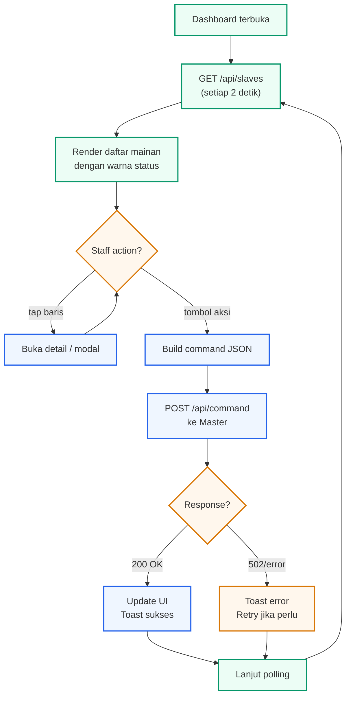
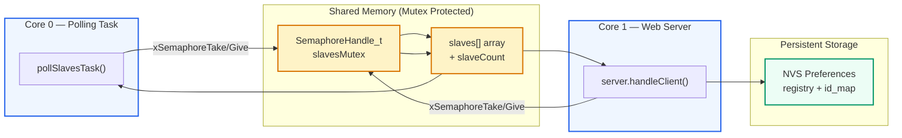

# Diagram Mermaid — Excavator Timer Wi-Fi Master-Slave

Diagram menggunakan Mermaid.js. Render di GitHub, Markdown preview, atau editor Mermaid.

---

## 1. Arsitektur Sistem

---

## 2. Wiring Relay Slave

---

## 3. State Machine Slave

---

## 4. Alur Tambah Waktu

---

## 5. Alur Hotswap Battery (Powerloss Recovery)

---

## 6. Alur Dashboard Polling

---

## 7. Arsitektur Data (Dual-Core + Mutex)

