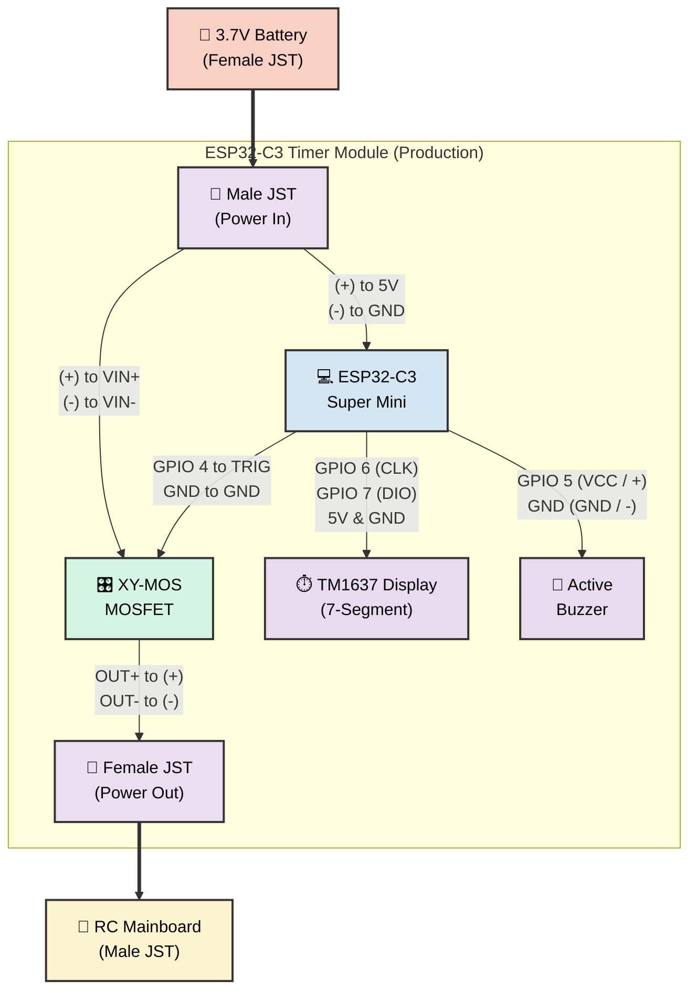

# 3.7V Battery & MOSFET Wiring Guide (XY-MOS)

This guide provides the wiring diagram and instructions for powering your ESP32 and the RC Excavator from a **single 3.7V Lithium Battery** using a Dual-MOSFET module (like the XY-MOS or similar) instead of a mechanical relay.

## Why MOSFET & JST Modular Design?
- **Silent Operation:** No clicking sounds compared to a mechanical relay.
- **Low Power Consumption:** The MOSFET gate requires practically zero current to hold open.
- **High Current / Low Voltage:** Excellent for 3.7V toy motors without voltage drops.
- **Plug & Play (JST Sockets):** The entire ESP32 Timer Module acts as an "in-line" cable. The battery plugs into the ESP32 Timer Module, and the ESP32 Timer Module plugs into the excavator. No wire cutting is required on the user's end!

---

## 1. Required Components
1. **1x 3.7V Lithium Battery** (e.g., 18650 or Li-Po battery).
2. **ESP32 Module** (Standard, NodeMCU, or C3 Super Mini).
3. **XY-MOS Module** (Dual MOSFET trigger switch).
4. **RC Excavator Mainboard** (The toy's receiver and motor controller).

---

## 2. Wiring Diagram

Here is the exact layout of how to wire the single 3.7V battery to power both the ESP32 and the excavator, using the MOSFET as the gatekeeper.

---

## 3. Creating the Plug-and-Play Module

Instead of hard-wiring the battery to the module, you will solder JST connectors to the ESP32 Timer Module so it acts like an extension cable.

### A. The Input JST Plug (From Battery)
Solder a **Male JST Plug** (to connect with the battery's Female JST) so its wires split into two paths inside the ESP32 Timer Module:
1. **To the ESP32 (Always On):**
   - JST Positive (+) ➔ **5V Pin** on the ESP32.
   - JST Negative (-) ➔ **GND Pin** on the ESP32.
2. **To the MOSFET (Power Switch):**
   - JST Positive (+) ➔ **VIN+** on the XY-MOS.
   - JST Negative (-) ➔ **VIN-** on the XY-MOS.

### B. The Output JST Socket (To Excavator)
Solder a **Female JST Socket** (to connect with the excavator's Male JST) directly to the MOSFET's output:
- **OUT+** on XY-MOS ➔ **Positive (+)** wire of the Output JST Socket.
- **OUT-** on XY-MOS ➔ **Negative (-)** wire of the Output JST Socket.

### C. Wiring the Trigger Signal
Connect the ESP32 to the XY-MOS trigger pins to control the flow of electricity:
- **GPIO 26** on ESP32 ➔ **TRIG** (or PWM) on the XY-MOS.
  > *If you are using the ESP8266, connect D1 (GPIO 5) to TRIG instead. If you are using the C3 Super Mini, connect GPIO 4 to TRIG.*
- **GND** on ESP32 ➔ **GND** (next to the TRIG pin) on the XY-MOS. *(This ensures a common ground for the trigger signal).*

---

## 4. How it Works
1. When the RC is powered on, the ESP32 boots up immediately and connects to WiFi.
2. The XY-MOS remains **OFF** by default. The RC Excavator has no power.
3. When the user starts a rental session, the ESP32 drives GPIO 26 to **HIGH (3.3V)**.
4. The XY-MOS detects the HIGH signal on the TRIG pin and opens the dual-MOSFET gates.
5. Power flows from `VIN` to `OUT`, powering the RC Excavator mainboard.
6. When time is up, the ESP32 drives its trigger pin (GPIO 4 for C3, GPIO 26 for standard) to **LOW (0V)**, closing the gates and instantly cutting power to the excavator.
