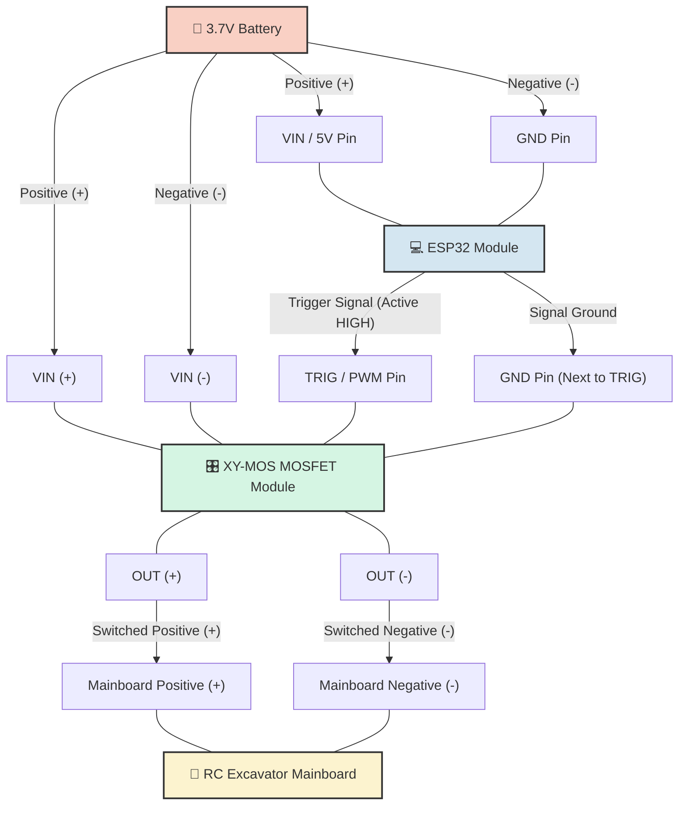

# 3.7V Battery & MOSFET Wiring Guide (XY-MOS)

This guide provides the wiring diagram and instructions for powering your ESP32 and the RC Excavator from a **single 3.7V Lithium Battery** using a Dual-MOSFET module (like the XY-MOS or similar) instead of a mechanical relay.

## Why MOSFET?
- **Silent Operation:** No clicking sounds compared to a mechanical relay.
- **Low Power Consumption:** The MOSFET gate requires practically zero current to hold open, unlike a relay coil.
- **High Current / Low Voltage:** Excellent for 3.7V toy motors which would otherwise suffer voltage drops across a mechanical relay's contacts.

---

## 1. Required Components
1. **1x 3.7V Lithium Battery** (e.g., 18650 or Li-Po battery).
2. **ESP32 Module** (Standard, NodeMCU, or C3 Super Mini).
3. **XY-MOS Module** (Dual MOSFET trigger switch).
4. **RC Excavator Mainboard** (The toy's receiver and motor controller).

---

## 2. Wiring Diagram

Here is the exact layout of how to wire the single 3.7V battery to power both the ESP32 and the excavator, using the MOSFET as the gatekeeper.

---

## 3. Step-by-Step Connection

### A. Powering the ESP32 (Always On)
Connect the 3.7V battery directly to the ESP32 so it is always awake and listening to the master network:
- **Battery (+)** ➔ **5V Pin** (or VIN) on the ESP32.
  > *Note: While labeled 5V, most ESP32 dev boards can successfully run off a 3.7V - 4.2V lithium battery through this pin because the onboard LDO regulator will drop it down to the 3.3V the ESP32 chip needs.*
- **Battery (-)** ➔ **GND Pin** on the ESP32.

### B. Powering the MOSFET Module
Connect the same battery directly to the high-power input of the XY-MOS module:
- **Battery (+)** ➔ **VIN+** on the XY-MOS.
- **Battery (-)** ➔ **VIN-** on the XY-MOS.

### C. Wiring the Excavator (The Load)
The output of the MOSFET will act as the new battery for the RC Excavator:
- **OUT+** on XY-MOS ➔ **Positive (+)** wire of the RC Mainboard.
- **OUT-** on XY-MOS ➔ **Negative (-)** wire of the RC Mainboard.

### D. Wiring the Trigger Signal
Connect the ESP32 to the XY-MOS trigger pins to control the flow of electricity:
- **GPIO 26** on ESP32 ➔ **TRIG** (or PWM) on the XY-MOS.
  > *If you are using the ESP8266, connect D1 (GPIO 5) to TRIG instead. If you are using the C3 Super Mini, connect GPIO 4 to TRIG.*
- **GND** on ESP32 ➔ **GND** (next to the TRIG pin) on the XY-MOS. *(This ensures a common ground for the trigger signal).*

---

## 4. How it Works
1. When the RC is powered on, the ESP32 boots up immediately and connects to WiFi.
2. The XY-MOS remains **OFF** by default. The RC Excavator has no power.
3. When the user starts a rental session, the ESP32 drives GPIO 26 to **HIGH (3.3V)**.
4. The XY-MOS detects the HIGH signal on the TRIG pin and opens the dual-MOSFET gates.
5. Power flows from `VIN` to `OUT`, powering the RC Excavator mainboard.
6. When time is up, the ESP32 drives GPIO 26 to **LOW (0V)**, closing the gates and instantly cutting power to the excavator.
