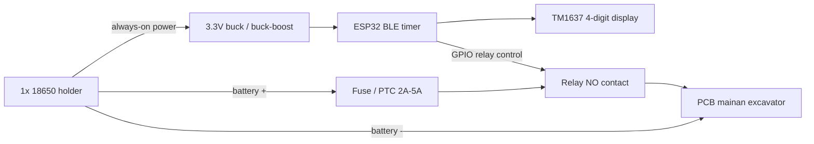
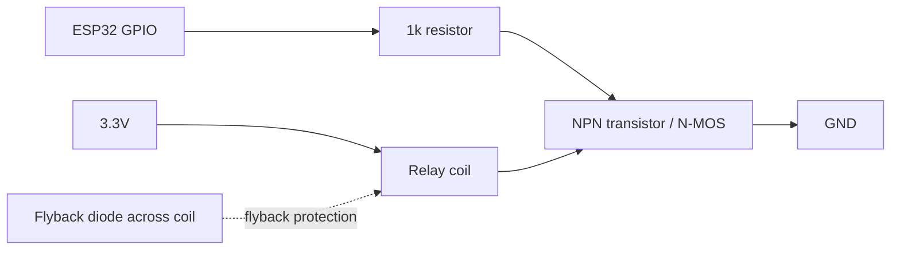

# Wiring Diagram - Relay Murah MVP

Mermaid diagram utama ada di [MERMAID_DIAGRAMS.md](MERMAID_DIAGRAMS.md).

## 1. Power Layout



## 2. Relay Contact Wiring

Use normally-open contact so toy is OFF by default.

```text
Battery + -> fuse/PTC -> relay COM
relay NO -> PCB mainan +
Battery - -> PCB mainan -
```

Do not switch ground.

## 3. Relay Coil Driver

GPIO must not drive relay coil directly.



Text wiring:

```text
ESP32 GPIO ---- 1k resistor ---- transistor base/gate

3.3V ---- relay coil ---- transistor collector/drain
transistor emitter/source ---- GND

diode flyback across relay coil:
diode cathode -> 3.3V side
diode anode   -> transistor side
```

## 4. Pin Proposal

| Function | ESP32 DevKit | ESP32-C3 Option | Notes |
| --- | --- | --- | --- |
| Relay control | GPIO26 | GPIO4 | Output, default OFF |
| Battery ADC | GPIO34 | GPIO0/ADC capable | Through divider |
| TM1637 CLK | GPIO18 | GPIO6 | 4-digit display clock |
| TM1637 DIO | GPIO19 | GPIO7 | 4-digit display data |
| Status LED | GPIO2 | GPIO8 | Optional |
| Service button | GPIO14 | GPIO9 | Pull-up input |

Adjust pins to board used. Avoid boot strap pins if relay could turn ON during boot.

## 5. TM1637 4-Digit Display

Display ditempel di mainan supaya customer/staff melihat sisa waktu tanpa membuka app.

```text
TM1637 VCC -> ESP32 3.3V
TM1637 GND -> GND
TM1637 CLK -> GPIO18
TM1637 DIO -> GPIO19
```

Display format:

```text
RUNNING:  MM:SS
PAUSED:   MMSS / colon blink
LOCKED:   ----
LOW_BATT: Lo
ENDED:    0000 blink
FAULT:    Err
```

## 6. Battery ADC Divider

For 1x18650:

```text
Battery + ---- R1 220k ----+---- ADC
                            |
                           R2 100k
                            |
GND ------------------------+
```

Add:

```text
100nF capacitor from ADC to GND
```

Voltage formula:

```text
Vbat = Vadc * (R1 + R2) / R2
Vbat = Vadc * 3.2
```

Threshold:

```text
OK       > 3.55V
LOW      3.30V - 3.55V
CRITICAL < 3.30V
CUTOFF   < 3.15V for 5-10 seconds
```

## 7. Cheap Relay Selection

Use:

```text
3V or 3.3V relay coil
contact rating >= 3A, better 5A
NO/COM contact
```

Avoid:

```text
5V relay coil direct from 1x18650
relay coil directly from ESP32 GPIO
toy motor current through breadboard rails
```

If using cheap relay module:

- Check it can trigger from ESP32 3.3V logic.
- Check relay supply voltage.
- Check module has transistor driver and diode.
- If module needs 5V relay supply, it needs boost 5V and costs more power.

## 8. Required Safety Behavior

Firmware must do this:

```text
setup:
  configure relay pin OFF before any BLE/timer init

boot:
  relay OFF
  load saved timer
  if remaining_seconds > 0:
      state = PAUSED
  else:
      state = LOCKED
```

Relay ON only when:

```text
state == RUNNING
remaining_seconds > 0
battery_status == OK or LOW
fault_code == NONE
```
